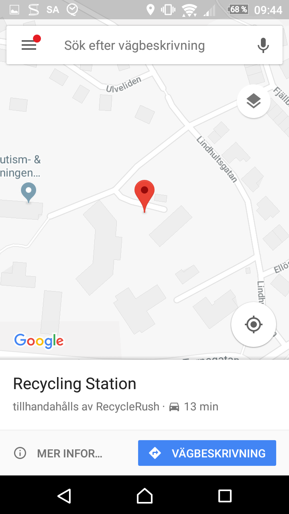
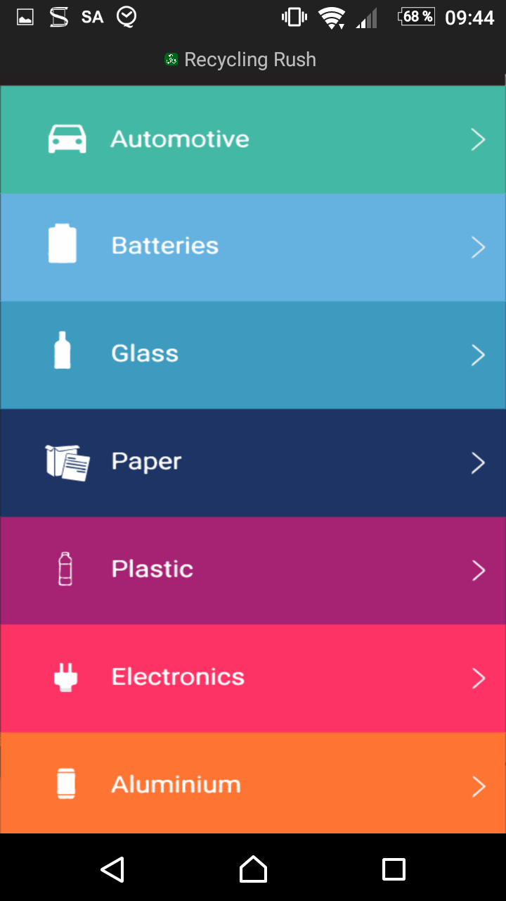
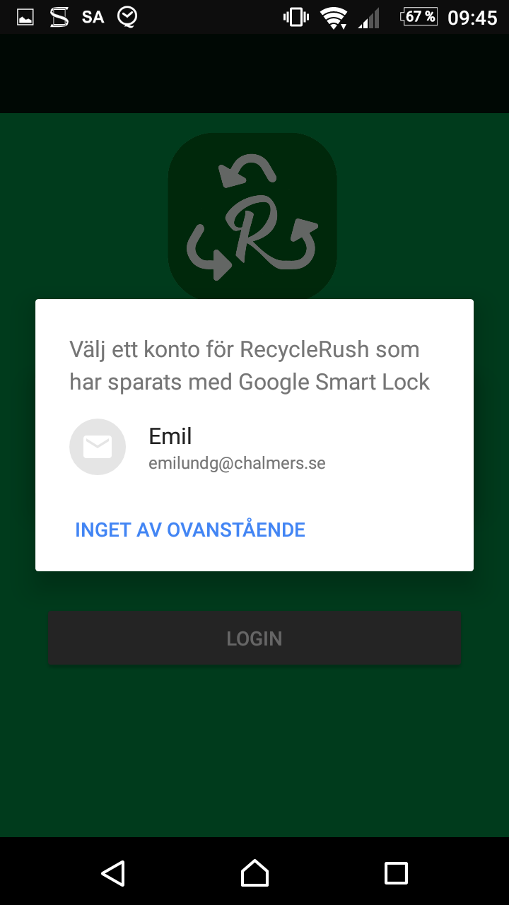
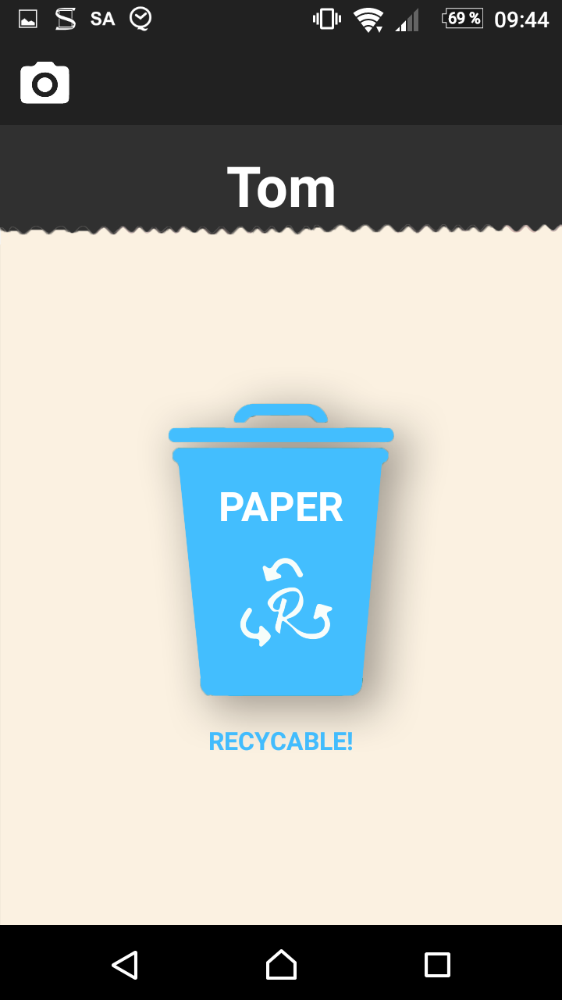
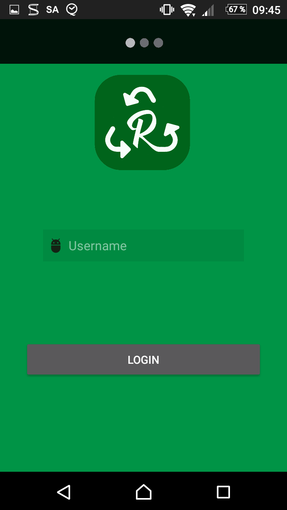
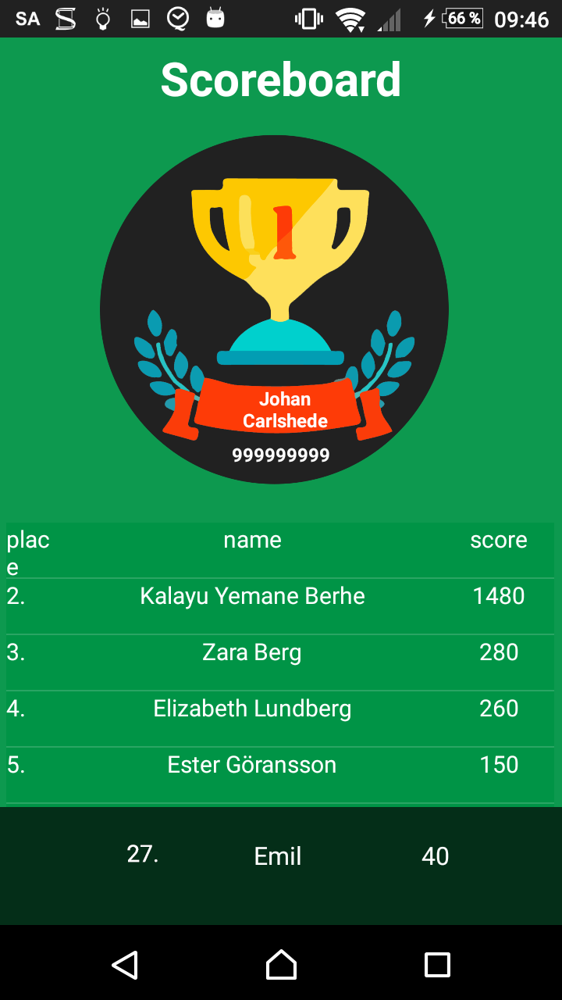

% Agile Development Processes Project Report  
  Team 5
% Kalayu Yemane Berhe; Johan Carlshede; Mahshid Golbaz Khanian; Tom Ille; Emil Lundgren; Jesper Olsson; Jesper Rask
%

This is the project report template.
Fill it out over the course of the project.

# Project Description
Recycled Corp is a world leader in recycling and we have just conducted a
study in why people are not recycling. Our idea is an application that can
help people to scan products via barcode (Or type it in) and see which
products can be recycled, how and where to recycle them. We also want to
reward the user for recycling so some nice messages would be good!

The application will be called Recycle Rush and will target Android versions
4.0.3 (Ice Cream Sandwich) and later. The primary programming language will
be Java.

The git repository can be found at https://github.com/IT-Kakan/adp_project

The issue tracker can be found at https://trello.com/b/xZWxyu2J/agile-development-processes

The continuous integration builds cab be found at https://travis-ci.org/IT-Kakan/adp_project

# Sprint 1 Log

## Commitment

- Fill backlog with possible features
- Select one spokesperson in the group
- Create a HelloWorld application (Initialize Android project)
- Create and upload a first report
- Implement Travis continuous integration

## Work Done

Feature | Time estimated | Time spent per team member
--------|----------------|--------
*Set up the project environment*|*12 hours*|*Kalayu: 2 hours, Johan: 2 hours, Mahshid: 2 hours, Emil: 2 hours, Jesper O: 2 hours, Jesper R: 2 hours*
*Filled the backlog and met with the customer*|*6 hours*|*Kalayu: 1 hour, Johan: 1 hour, Mahshid: 1 hour, Emil: 1 hour, Jesper O: 1 hour, Jesper R: 1 hour*
*Initialised the report*|*40 mins*|*Jesper O: 40 mins*
*Initialised the Android Project*|*20 mins*|*Johan: 20 mins*
*Set up Travis-CI*|*20 mins*|*Jesper O: 20 mins*

## Reflections
There is not much to reflect on, as this was not a typical development sprint. We met for the first time and set up the basis for the project. We were successful in splitting the work between us and managed to complete all assigned tasks.

Given the atypical nature of this sprint, we have chosen to not reflect on agile practices. However, we have made knowledge transfer within the group, as we had different experiance on setting up of the basis of the project.

# Sprint 2 Log

## Commitment
* The group attended the acceptance test and sprint retrospective for the last sprint.
* We estimated the story points for each feature in sprint 2's backlog using planning poker.

We completed the following user stories

* ID: 1. As a customer I instantly want to be prompted with the camera on my phone so that I can scan items (Estimate: 4 pts)
* ID: 2. As a user I want to see what products that can be recycled so that I can recycle properly (Estimate: 7 pts)
* ID: 3. As a user I want to scan at least two different item/product so that I can get information about them in the application (Estimate: 7 pts)

## Work done
Feature | Time estimated | Time spent per team member
--------|----------------|--------
Acceptance test 1 | 3 hours 30 mins | Kalayu: 30 mins, Johan: 30 mins, Mahshid: 30 mins, Tom: 30 mins, Emil: 30 mins, Jesper O: 30 mins, Jesper R: 30 mins
Planning | 6 hours 10 mins | Kalayu: 50 mins, Johan: 50 mins, Mahshid: 50 mins, Tom: 50 mins, Emil: 50 mins, Jesper O: 50 mins, Jesper R: 50 mins
*ID: 1.*|*3 hours*|*Jesper O: 3 hours*
*ID: 2.*|*4 hours 20 mins*|*Mahshid: 2 hours, Emil: 2 hours, Jesper R: 1 hour*
*ID: 3.*|*8 hours 10 mins*|*Kalayu: 3 hours 40 mins , Johan: 4 hours 10 mins, Tom: 20 mins*
*Stand-up meetings*|*2 hours 20 mins*|*Kalayu: 20 mins, Johan: 20 mins, Mahshid: 20 mins, Emil: 20 mins, Jesper O: 20 mins, Jesper R: 20 mins*
*Impedement removal*|*45 mins*|*Jesper O: 45 mins*
*Wrote report*|*1 hours 20 mins*|*Jesper O: 40 mins, Jesper R: 40 mins*

## Reflections

We had three group meetings in this sprint that were about two hours long each. The team work seems to improve, as there was a lot of communication on the tasks and team members that were done with their task tried to helped the others with theirs. However we noticed that it is hard to find meeting times where everybody is available.

The team velocity were quite inaccurate this sprint. All the group members finished quite fast with each task. After the acceptance test 1 we talked with our product owner(Magnus), about what he expects after the upcoming sprint. He gave us the minimum requirements for the sprint, and this made us estimated the work to be done, in a way of the "demands" of Magnus. Throughout the sprint we realised that this is the wrong way to go, since our estimations were a reflection of Magnus demands. For the upcoming sprint we will estimate a set of task before meeting with Magnus, to gain a better overview of what the group actually are able to achieve in one sprint.

Mahshid and Emil experienced pair-programming in our group and it took 4 hours to complete task. Moreover, Johan and Kalayu also partly applied extreme programming agile practices while applying an API for our barcode scanner feature. One positive aspect of this practice was knowledge transfering because we have this chance that one act as a observer and monitored the driver's code in order to collaburate regularly and switched the role at any time. However, we experience some difficulties in time management.

# Sprint 3 Log

## Commitment
* The group attended the acceptance test and sprint retrospective for the last sprint.
* We estimated the story points for most of the features in sprint 3's backlog using planning poker.

We committed to the following user stories

* ID: 4. As a user I want to input the barcode in text format so that I can get information about it in the application.
* ID: 5. Create local users.
* ID: 6. Configure the test-environment, and write a sample test.
* ID: 7. As a user I want to see where I can recycle the scanned product so that I know where to recycle it.
* ID: 8. As a user I want to navigate through the app so that I can view different views.
* ID: 9. fix scanning of barcode.
* ID: 10. Display user information.

We failed to complete the following user stories

* ID: 6.

## Work Done

Feature | Time estimated | Time spent per team member
--------|----------------|--------
*User story estimation*|*7 hours*|*Kalayu: 1 hour, Johan: 1 hour, Mahshid: 1 hour, Tom: 1 hour, Emil: 1 hour, Jesper O: 1 hour, Jesper R: 1 hour*
*Acceptance test 2*|*2 hours 20 mins*|*Kalayu: 20 mins, Johan: 20 mins, Mahshid: 20 mins, Tom: 20 mins, Emil: 20 mins, Jesper O: 20 mins, Jesper R: 20 mins*
*Coach meeting*|*2 hours 20 mins*|*Kalayu: 20 mins, Johan: 20 mins, Mahshid: 20 mins, Tom: 20 mins, Emil: 20 mins, Jesper O: 20 mins, Jesper R: 20 mins*
*Sprint retrospective*|*2 hours 20 mins*|*Kalayu: 20 mins, Johan: 20 mins, Mahshid: 20 mins, Tom: 20 mins, Emil: 20 mins, Jesper O: 20 mins, Jesper R: 20 mins*
*Planning*|*6 hours 10 mins*|*Kalayu: 50 mins, Johan: 50 mins, Mahshid: 50 mins, Tom: 50 mins, Emil: 50 mins, Jesper O: 50 mins, Jesper R: 50 mins*
*ID: 4.*|*6 hours*|*Kalayu: 6 hours*
*ID: 5.*|*7 hours*|*Jesper R:7 hours*
*ID: 6*.| *7 hours* | *Jesper O: 7 hours*
*ID: 7.*| *12 hours* |*Johan: 4 hours, Mahshid: 8 hours*
*ID: 8.*|*5 hours* |*Emil: 5 hours*
*ID: 9.*|*3 hours* |*Tom: 3 hours*
*ID: 10.*|*6 hours* |*Jesper R:, Emil:*
*Refactoring*|*2 hours*|*Tom: 2 hours*
*Stand-up meetings*|*2 hours 20 mins*|*Kalayu: 20 mins, Johan: 20 mins, Mahshid: 20 mins, Emil: 20 mins, Jesper O: 20 mins, Jesper R: 20 mins, Tom: 20 mins*
*Wrote report*|*2 hours 30 mins*|*Kalayu: 30 mins,  Jesper O: 1 hour 10 mins, Jesper R: 30 mins, Johan: 10 mins, Mahshid: 10 mins, Tom: 10 mins*

## Reflections
Jesper and Emil experienced pair-programming in our group, this was necessary since their tasks were closely related. We think it was more effective to do it as a pair, since both knew what had been done on each part.

When planning the sprint, we realised that we wanted to practice test-first. It sounds quite promising in theory, but we wanted some more practical experience. This is what ID 6 was about and as can be seen from the low estimate, we thought it should be quite straightforward to set up test suites for Travis to execute. Indeed, we understand this as one of the main purposes for the software. In spite of this, we were unable to complete the task within the allocated time. We were able to find neither sufficient documentation or tutorials and many of the solutions suggested on the web fell short. From what we gather, we must execute steps that the Travis team claim "are not fully supported by Travis CI Android builder." While it simply could be that we're missing something obvious, we never-the-less feel that we have not got enough instruction in how to use Travis, despite it being mandatory in the course.

Early in the sprint, we realised that we have difficulties with writing the report. The previous hand-ins have been completed on the final day, which results in us not properly reviewing the document. This became apparent with the report for sprint 2, where we after submission deadline detected errors thought to arise from text integration problems. As other issues have been more pressing this sprint, we have not reflected much on how to address this issue. While our process likely can be improved, it also feels like the current setup (at least partially) works against us. At least when compared to working at a company, our work schedule is quite ad-hoc. This makes time tracking difficult, especially since we are supposed to report on each activity. In addition, we read different courses, which results in us being split up and everyone has to keep track of their own time, what practices they used and their reflection of these. Naturally, this makes it difficult to synthesise the report. Finally, we feel that there is very little motivation for writing the report. It is administrative overhead and often feels like a chore that provide no real benefit.

After the project has grown over the last sprints, it made sense to think about refactoring the code. Two major things have been done in the process of refactoring. One was to check whether the coding style that the team decided on has been used at all time. This change was rather small as the coding style was mainly applied. A bigger change was made in the apps main activity, which we found to be a bit more challenging. Since everyone is working in or using the apps main activity, it was rather hard to incorporate bigger changes, since everyone had to merge their local solution with the refactored one. We solved it by waiting for refactoring until most tasks of the sprint have been implemented to reduce the time people spend merging the two conflicting versions of the solution. After all, it was a good step to introduce the refactoring to the project, as it made the code more readible and maintainable.

# Sprint 4 Log
 
## Commitment
* The group attended the acceptance test and sprint retrospective for the last sprint.
* We estimated the story points for all of the features in sprint 4's backlog.

We committed to the following user stories

* ID 11. As a user I want to be rewarded with credits for my recycled items and see my result on a scoreboard so that I can compare my recycling to others.
* ID 12. Make an own file of the manual text input field and add navigation from barcode scanner into manual text layout and vice versa
* ID 13. Create a profile for each user - firebase?
* ID 14. As a user I want to have a visualisation of a seed that grows into a tree depending on my credit score history so that I can see my total amount of recycling
* ID 15. View categories - closest place where to recycle what. Not all can be recycled everywhere
* ID 16. Connect the user profile to facebook. Be able to share something on facebookwall.

## Work Done

Feature | Time estimated | Time spent per team member
--------|----------------|--------
*Acceptance test*|*1 hour 45 mins*|*Kalayu: 15 mins, Johan: 15 mins, Mahshid: 15 mins, Tom: 15 mins, Emil: 15 mins, Jesper O: 15 mins, Jesper R: 15 mins*
*Sprint retrospective*|*2 hours 20 mins*|*Kalayu: 20 mins, Johan: 20 mins, Mahshid: 20 mins, Tom: 20 mins, Emil: 20 mins, Jesper O: 20 mins, Jesper R: 20 mins*
*Sprint planning*|*5 hours 15 mins*|*Kalayu: 45 mins, Johan: 45 mins, Mahshid: 45 mins, Tom: 45 mins, Emil: 45 mins, Jesper O: 45 mins, Jesper R: 45 mins*
*Stand-up meetings*|*1 hour 15 mins*|*Johan: 15 mins, Mahshid: 15 mins, Emil: 15 mins, Jesper O: 15 mins, Jesper R: 15 mins*
*ID: 11*.|*9 hours*| *Tom: 6h, Jesper O: 3 h*
*ID: 12.*|*6 hours*| *Kalayu: 6h*
*ID: 13.*|*9 hours*| *Johan: 9h*
*ID: 14.*|*6 hours*| *Emil: 6h*
*ID: 15.*|*13 hours*| *Mahshid: 13h*
*ID: 16.*|*7 hours*| *Jesper R: 7h*
*Resolved merge conflicts*| *1 hour 50 mins* | *Kalayu: 40 mins, Johan 20 mins, Emil 20 mins, Jesper O: 30 mins*
*Refactoring*|*1 hour*|*Tom: 30 mins, Jesper O: 30 mins*
*Unit testing*|*1 hour 10 mins*|*Jesper O: 1 hour 10 mins*
*Wrote report*|*1 hour 15 mins*|*Kalayu: 15 mins, Johan: 20 mins, Emil: 10 mins, Jesper O: 30 mins*

## Reflections
Tom and Jesper O tried out pair programming. We feel that there certainly are many aspects to reflect on, both positive and negative. The topic is, however, rather multifaceted and we think it would too bold to make statements about the general case. We experienced pair programming to be a nice way of working with the product. Talking, sharing ideas, communicating or simply associating with one another had a positive impact on our attitude to the task. We believe that this is important in long-running projects (especially after Lucas' lecture), but also that it is difficult to quantify. In terms of conventional productivity measures, we think that we performed worse when pair programming this task, but we can't name a figure. The first part of the task was more or less routine work and is the main reason for our beliefs. The second part was more about knowledge gathering than anything else and we don't know if there would have been a difference, one way or another, if we were not pair programming. In the end, we think that the task was perhaps not the best for applying this practice on, but we remain optimistic about the human aspect of it.

# Sprint 5 Log

## Commitment

We committed to the following user stories

* ID 17: Connect scoreboard to user database
* ID 18: Make the app look crisp
* ID 19: debug scanning / navigation
* ID 20: Can see the categories from the scan item screen

## Work Done

Feature | Time estimated | Time spent per team member
--------|----------------|--------
*Meeting*|*3 hours 30 mins*|*Kalayu: 30 mins, Johan: 30 mins, Mahshid: 30 mins, Tom: 30 mins, Emil: 30 mins, Jesper O: 30 mins, Jesper R: 30 mins*
*Sprint retrospective*|*1 hour 45 mins*|*Kalayu: 15 mins, Johan: 15 mins, Mahshid: 15 mins, Tom: 15 mins, Emil: 15 mins, Jesper O: 15 mins, Jesper R: 15 mins*
*Acceptance test*|*1 hour 45 mins*|*Kalayu: 15 mins, Johan: 15 mins, Mahshid: 15 mins, Tom: 15 mins, Emil: 15 mins, Jesper O: 15 mins, Jesper R: 15 mins*
*Stand-up meetings*|*50 mins*|*Kalayu 10 mins, Johan 10 mins, Mahshid 10 mins, Emil 10 mins, Jesper O: 10 mins*
*ID 17*|*3 hours*|*Johan: 3 hours*
*ID 18*|*12 hours*|*Emil: 12 hours*
*ID 19*|*3 hours*|*Kalayu: 3 hours*
*ID 20*|*30 mins*|*Mahshid: 30 mins*
*Refactoring*|*5 hours 30 mins*|*Johan: 2 hours 30 mins, Tom: 3 hours*
*Wrote postmortem*|*10 hours 45 mins*|*Tom: x hours y mins, Jesper O: 5 hours 45 mins, Jesper R: 5 hours 0 mins*
*Postmortem review*|*6 hours 35 mins*|*Kalayu: 1 hour 5 mins, Johan: 1 hour 5 mins, Mahshid: 1 hour 5 mins, Tom: 35 mins, Emil 1 hour 5 mins, Jesper O: 1 hour 5 mins, Jesper R: 35 mins*
*Presentation planning*|*6 hours 25 mins*|*Kalayu: 55 mins, Johan: 55 mins, Mahshid: 55 mins, Tom: 55 mins, Emil 55 mins, Jesper O: 55 mins, Jesper R: 55 mins*
*Wrote report*|*2 hour 10 mins*|*Jesper O: 2 hour 10 mins*

# Postmortem

## Agile practices reflection
Given the limited experience that a single project of this type provides, we would argue that Meyer's assessment of agile is comparatively aligned with ours. However, we feel that several practices were not sufficiently tried out to give us proper assessments. As discussed later in the report, we agree with Meyer that test-first, pair-programming and onsite customer are questionable practices or perhaps limited to specific cases. We also confirm that small releases is a beneficial practice, at least in this project.

### General thoughts on agile practices

#### Practice interaction
We argue that the agile practices interact in a multitude of ways, both positively and negatively. We won't cover them all in detail, but rather focus on which we argue are the top three interactions. Broadly speaking, the practices synergize well with each other, both as complementary ideas and through amplification effects.

The first interaction we will discuss is the synergy between the practices planning game and sustainable pace. The former empowers the developers in reasoning about, estimating and communicating how much effort each task will require. We believe that these estimates are more accurate than those arising in traditional planning. The work units are encouraged to be small and the developers are experts on the subject of their own competence. The more accurate the estimates are, the more accurate the velocity assessments become. Consequently, schedule-related overtime and burnout effects are less likely to occur.

Second, we argue that the practice of small releases synergises well with continuous integration. The former implies that the duration for which the product may be in an undeployable state is lowered. One important criterion for being deployable is that all tests should pass. The practice of continuous integration aims to ensure that every code change results in a product that passes all tests. In other words, in the extreme case, continuous integration pushes the duration between deployable versions to zero.

As discussed above, continuous integration aims to ensure that every change of the codebase results in a correct product. We believe that the risk of breaking a working part of the product is a major deterrent for conducting refactoring. By eliminating this risk (at least as far as the tests are concerned), continuous integration synergises well with refactoring.

#### Practice efficiency
All in all, we find it difficult to assess the practices in general only from the project. The project was quite limited in scope and expected longevity, which meant that the consequences of the practices were skewed. We believe that some practices give diminishing returns, perhaps even becoming a liability with time. Conversely, we believe that other practices become more efficient with time.

### Planning game
We found the planning game to be a useful practice in this project and employed it throughout the entirety of the project. We certainly did not execute the practice perfectly, as there were a few occurrences where we and the customer decided on commitments that were not estimated. Such execution carries risks of over- or underestimating the velocity of the team, potentially resulting in repercussions for the team, customer or other stakeholders.

### Small releases
At the end of each iteration, we introduced new features to the app that are integrated, working and tested. Each iteration was about 1-2 weeks long and for each iteration, we released running and tested features chosen by our customer. Our goal for each sprint was to finish a small set of functionality, based on the user stories and deliver visibly improved software to the customer. Throughout the project, the length of cycles differed a bit which hampered the time distribution and workload. Otherwise, the small releases were helpful for this project, since at the end of each iteration the customer could give us feedback on the newly introduced functionality. We believe that it's critical to get feedback at an early stage of development to avoid unnecessary blunders.

### Metaphor
We did not employ the metaphor practice in this project. The intent of the application and its software components were quite palpable. As a result, there seldom was any confusion between stakeholders that warranted the need for metaphors.

### Simple design
We found that our project naturally joined with the simple design practice. The scope of the application was both small and emergent, which meant that it was natural to defer architectural decisions. The problem domain exhibited no inherent complexity that would require strong coordination of components. We think that this is a common property of mobile applications, which leads to this practice being quite apt for that kind of projects. However, we are unsure of how the practice applies to large-scale systems or domains where the components are intrinsically complex.

### Test-first
The test-first practice was not well suited for this GUI intensive project. The initial thought was to adopt the test automation pyramid as a strategy. This would provide us with running unit tests after every build and give us feedback immediately. However, GUI testing often requires a human touch and is difficult to create with scripts. Based on previous experience, GUI testing often require a lot of programming and can be time-consuming. Consequently, we decided to not focus on this principle in order to dedicate time to the other principles.

### Refactoring
In this project, refactoring did not become an ingrained part of the standard development process. This meant that every developed feature accrued technical debt. Refactoring was instead done in a reactive and ad-hoc fashion, which did not yield the potential benefits. Arguably, this may have been a result of the size of the project. Since the beginning, we have not expected the longevity of the codebase to exceed the time and effort designated by the course. In other words, the cost of the technical debt is comparatively low, even in instances were refactoring would yield a higher reward. Consequently, the incentive to perform refactoring was low and may not properly reflect our behaviour in large-scale software projects.

### Pair-programming
Pair-programming was generally an agreeable practice, but it is difficult to assess the trade-offs. Depending on how the balancing factors are weighted, our opinion of pair-programming differs. On one hand, we generally thought that the practice was useful for knowledge, morale and comradeship. On the other hand, we felt that pair-programming easily became a waste of resources, which might lower morale and comradeship. One aspect to consider is what support the practice could gain from appropriate tools. We believe that we would have appreciated more if pair-programming was conducted in a collaborative document environment (e.g. Google Docs or Teletype in Atom).

### Collective Code ownership
Because the team was self-organised and lacked imposed power hierarchies, collective code ownership emerged naturally in this project. Although there probably was some skill variance within the team, we were peers to a larger extent than would be expected in industry. We are all quite limited in our experience, both general and specific. As a result, tasks were assigned in an ad-hoc fashion where personal preference played an unusually large part. We think that this approach led to the members being less overconfident and more humble, which in turn led to high acceptance of modifications made by the rest of the team.

### Continuous Integration
We were unable to sufficiently explore continuous integration, as we lacked experience with the suggested tools. Continuous integration is intended to be used in a combination of different automated tests such as unit tests, integration tests and hardware tests. In an early stage of the project, we configured the continuous integration environment, using Travis CI. Each push to git was supposed to go through a set of tests and then the developer is given direct feedback. However, we were not able to create a sufficient amount of different tests for this to be rewarding for the development. We struggled with finding what code fragments to test and were it would be helpful to execute a test driver development. 
Sustainable Pace
The practice of sustainable pace could not fully be reflected in this project. Because of the limitations of the setting, we could not fully reflect on the practice of sustainable pace in the project. Indeed, we rather experienced the opposite effect in the sense that the pace was too slow to spark much engagement in the development of the product. That said, the alternative of consciously subject the students to an unsustainable pace seems irresponsible. We believe that there is some middle ground, but it may be a difficult target to find within the current constraints of the course. 

### Onsite Customer
The structure of this project did not in a satisfactory manner support the idea of an onsite customer. A project with this structure requires frequent communication with the customer. The customer is not supposed to help the development team, but to be a great part of the thoughts and ideas. At the beginning of the project, the customer and the development team created user stories for the application’s desired functionality. Moreover, throughout the project, the customer negotiated a set of user stories that should be included in the next release. The meetings with the customer were strictly time-limited and the discussions were rushed through. We met the customer for about 15 minutes per sprint. Onsite implies that the customer is available on demand whenever the team develops the product. While we could meet the customer at the workshops, we often developed during the weekends. Furthermore, the customer did not become a part of the team in the same manner as we expect the onsite customer to be. Estimation and planning is the key of every iteration in an agile project and the customer should show great commitment in these sessions to provide a better understanding of the issues. However, due to the strict time limit of these sessions, we were not able to have the desired discussions.

### Coding Standards
The coding standards we applied were not automatically enforced and were insufficient to eliminate individual differences in coding style. There is more to one’s style than is commonly covered in style guides; code elegance is seldom a matter of issues like the placement of curly brackets. While small details definitely may result in heated arguments, the benefit of adopting a standard is not obvious. Of course, a standard that educates team members in readability are beneficial, but they often they are considered with nothing more than style. Style is in many cases a personal preference, neither more right or wrong than another. It seems like coding standards often result in one preference type being annoyed while programming, instead of another at reviewing. We argue that it would be more useful to handle style differences through IDE, where the code could be displayed in different styles depending on the user’s settings.

## Most impactful practices

### Positive
Small Releases was a practice that we all valued very much since it enabled quick and easy changes and allowed to manage the progress of the project. We met with the customer at the end of each sprint to present the current release. That enabled us to ensure that the customer was satisfied and that we were working on things that mattered to him. Also, the progress was easily tracked with the small releases because we could perceive the weekly growth.

### Negative
In this project, two agile practices had substantial negative import on the product. Interestingly, we argue that this outcome is innate for neither practice but rather a consequence of inexperience or constraints.

#### Planning game 
The planning game practice was problematic, in no small part due to the inexperience of the team members. The estimates were inaccurate and were often more akin to guessing or hand-waving than to well-grounded estimates. This was particularly evident in the earlier sprints, which could perhaps be explained by the students adapting to the practice. However, there are other explanations just a probable, such as group maturity.

#### Onsite Customer 
The onsite customer was arguably not practised correctly, as we discussed in earlier sections. Above all else, the customer was biased in favour of the group and was in many senses more like a coach than a customer. They did not strive to achieve the maximum sustainable velocity and thus often made unrealistic trade-offs during the sprint planning. In addition, the customer was less available than what we understand is expected in this practice. We met with the customer for a quarter-hour at the beginning of each sprint, much of which was wasted due to context switching and recaps. Even when meeting with the customer outside of the allocated time slots, the communication was constrained in a way that is not reflected in the literature.

## Future considerations
If the group were to do a similar project in the future, the first and foremost thing would be structuring the responsibilities better. With a more structured group a lot of problems would be avoided. We feel that there should be some delegation of administrative tasks, so the responsibilities doesn’t remain floating. This could be achieved with a stronger focus on one single agile methodology, instead of combining some of them. 

For the future project we would also put more thought into the planning game. We really liked the initial idea with the game, with estimations for each user story and plan the prospective sprint based on the result. However, we had a hard time estimating the development capacity and putting arbitrary numbers for each task. We feel like this is something that you learn after you’ve been doing it for a while, but until that, the estimations remain inaccurate and the impact of the planning game is rather low. 

The last thing we would have done differently is to emphasize communication more. Many time consuming problems were rooted in misunderstandings and would be easy to avoid with great established communication. Many of the group member also prefer to do more pair-programming in a future project, since the beginning of pair programming always includes a time of getting used to each other’s way of working. Once both involved group members get to know each other’s way of working better, we feel like the productivity could be raised a lot.

# Project outcome

